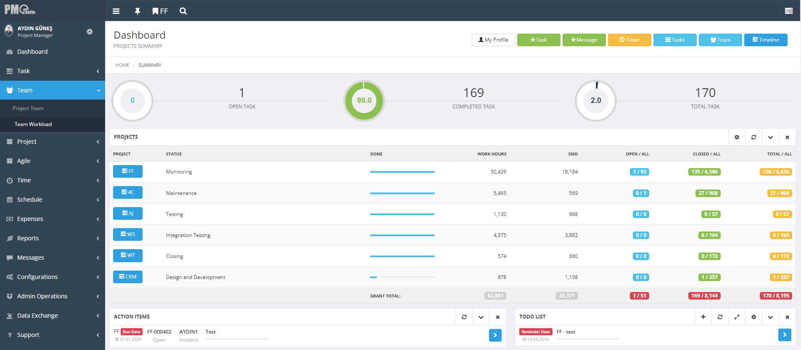
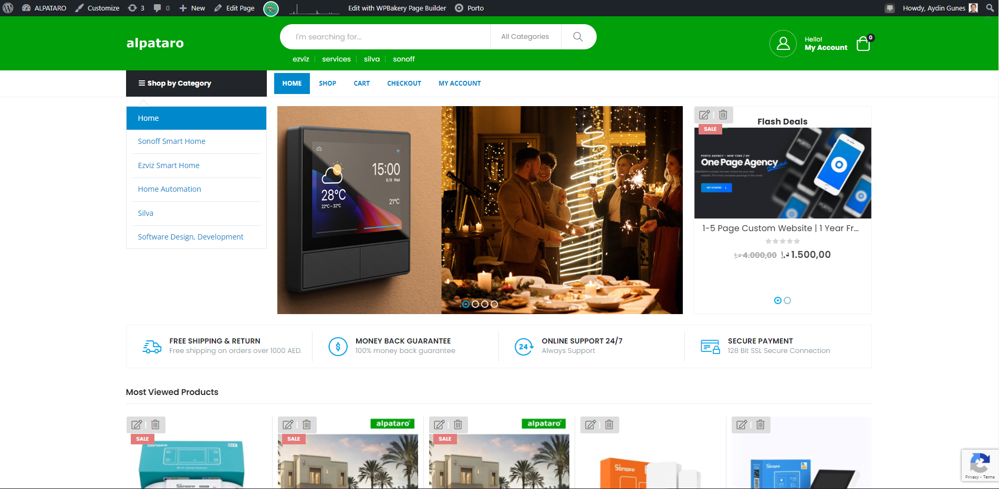

# About Me

I am a Highly strategical, success-oriented, hands-on, challenge-driven Information Technologies professional with 20+ years of in-depth knowledge of organizing, maintaining, developing, and implementing information systems and projects to enable organizations to stay competitive. Technically sophisticated and business-savvy management Professional with expertise in the design, delivery, and operations of high-performance technology solutions. Proven track record in driving successful product launches and managing end-to-end product lifecycle, with a strong background in both technical and business domains. “Hands-on” experience in all phases of the information systems life cycle, from initial feasibility analysis and conceptual design through implementation, enhancement, and operations. Excel at translating customer insights into actionable product strategies, leveraging market research and data analysis to identify and capitalize on emerging trends and opportunities. Ability to adapt quickly to changing market dynamics and apply a data-driven approach. Agile mindset to react efficiently and appropriately to rapidly changing business environment. Role modeling the desired leadership behaviors and creating the culture and conditions to empower people to work across organizational boundaries, in multi-disciplinary teams, and in service of strategic priorities. For further details, click [here](about.md).

# My Portfolio

Welcome to my portfolio! Here, you'll find a collection of projects and articles that showcase my work and experiences over the past 20 years in the field. Feel free to explore and learn more about my journey. 

## Solutions from Alpataro Technology

Visit my official website **[alpatarotechnology.com](https://www.alpatarotechnology.com)** to explore a range of innovative solutions and services offered by Alpataro Technology, including:

- **Solution 1: Project Management and Resource Planning Solutions**: [PMOSuite.com](projects/pmosuite/README.md)

Feel free to explore these solutions on the website to learn more about the services and expertise provided by Alpataro Technology.

## [PMOSuite.com - Project Management and Resource Planning Application](projects/pmosuite/README.md)

For more details about PMOSuite.com, click [here](projects/pmosuite/README.md).

- **Solution 2: Custom Website Design and Development**: [alpataro.com](projects/custom-website-design-and-development/README.md)

Feel free to explore these solutions on the website to learn more about the services and expertise provided by Alpataro Technology.

## [ALPATARO.COM -  Custom Website Design and Development](projects/custom-website-design-and-development/README.md)

For more details about  Custom Website Design and Development, click [here](projects/custom-website-design-and-development/README.md).

## Other Projects

In addition to the above solutions, you will find various other projects in this repository or as an external link to the project involved me that highlights my expertise in different domains. Feel free to explore them and check out their respective README files for more information.

- **IoT**: [IoT Project](projects/iot-project/README.md)
- **B2B Integration**: [B2B Integration Project](projects/b2b-integration/README.md)
- **Loyalty Management System (LMS)**: [Turkish Airlines](https://www.turkishairlines.com/en-int/miles-and-smiles/)
- **Customer Contact Centre (CRM)**:
- **Loyalty Management System (LMS)**
- **Customer Contact Centre (CRM)**
- **Loyalty Partner Manag. System (STAR, SKY)**
- **Delayed Baggage Tracking System**
- **Non-Air Partner Portal for LMS**
- **LMS Selling and Payment Gateway Integration**
- **Digital Transformation of the system to SOA**
- **LMS Mobile App**
- **Revamping the Loyalty and CRM systems**
- **LMS Integration with STAR and SKY Team**
- **Amadeus LMS and Altea PSS Integration**
- **Passenger Services System (PSS)**
- **Online Reservation and Ticketing System for Airlines and Ferry Lines**
- **Customer Contact Centre (CRM)**
- **Flight Schedule Planning**
- **Flight Operation Control Centre**
- **Slot Coordination**
- **Revenue Cost Analysis**
- **Revenue Accounting**
- **Crew Planning Management**

<!--
## Blog

I also share my thoughts and experiences through blog posts and articles. Check out the [blog](blog/) section to read about various topics related to project management, software development, and more.
-->
## My Resume

You can download my **[Resume](resume/AydinGunes_Resume.pdf)** to explore more about me.

## Contact Me

If you have any inquiries or would like to get in touch, please feel free to reach out to me at [aydin.gunes@alpataro.com](mailto:aydin.gunes@alpataro.com).
If you prefer another method of communication click [here](contact.md). 

Thank you for visiting my portfolio, and I hope you find it informative and engaging!
