# Custom Website Design and Development

Welcome to the README for the Custom Website Design and Development project. This project showcases my expertise in designing and developing custom WordPress websites tailored to clients' specific needs and brand identities. Below, you will find details about my tasks, responsibilities, and the technologies and skills used in this project.

## Tasks and Responsibilities

- **Designed and Developed Custom WordPress Websites**: I created unique and visually appealing WordPress websites using the Porto theme. Each website was tailored to meet the specific requirements and brand identities of our clients.

- **Configured WooCommerce E-commerce Solutions**: I ensured seamless online shopping experiences by setting up and configuring WooCommerce, a powerful e-commerce plugin for WordPress.

- **Integrated and Customized WordPress Plugins**: To enhance website functionality, I integrated and customized WordPress plugins, including payment gateways, SEO tools, and forms, to meet our clients' needs.

- **Managed Website Hosting on AWS CloudSail**: I set up and managed website hosting on AWS CloudSail, optimizing performance and security for high-traffic e-commerce sites. This included ensuring high availability, scalability, and efficient resource utilization.

- **Implemented CI/CD Pipelines**: I established continuous integration/continuous deployment (CI/CD) pipelines to automate updates and maintenance tasks, ensuring the website stayed up-to-date and secure.

- **Ensured Responsive Web Design**: I implemented responsive web design techniques to ensure optimal performance on various devices, including mobile phones and tablets, improving the overall user experience.

- **Implemented UX Best Practices**: I incorporated user experience (UX) best practices to enhance site navigation, usability, and conversion rates, ensuring that visitors had a positive interaction with the websites.

- **Conducted Performance Tuning**: To optimize website speed and reduce page load times, I performed performance tuning, enhancing user satisfaction and improving search engine optimization (SEO) rankings.

- **Implemented Security Measures**: I implemented robust security measures, including SSL certificates and firewalls, to protect customer data and prevent cyber threats, ensuring a safe and secure online environment.

## Skills / Technologies

- **WordPress**: Proficient in WordPress CMS for website development and content management.

- **WooCommerce**: Experienced in setting up and configuring WooCommerce for e-commerce functionality.

- **Porto Theme**: Expertise in using the Porto theme for creating visually appealing and customizable websites.

- **PHP**: Utilized PHP for customizing WordPress themes and plugins.

- **AWS CloudSail**: Managed website hosting on AWS CloudSail, optimizing performance and security.

- **HTML/CSS**: Proficient in HTML and CSS for website layout and styling.

- **JavaScript/jQuery**: Implemented JavaScript and jQuery for interactive website features.

- **MySQL**: Utilized MySQL for database management and data retrieval.

- **Payment Gateway Integration**: Integrated various payment gateways (e.g., PayPal, Stripe) for seamless online transactions.

- **SEO Optimization**: Implemented SEO best practices to improve website visibility and search engine rankings.

- **Responsive Web Design**: Ensured websites were responsive and performed well on different devices.

- **SSL Certificates and Security Measures**: Implemented SSL certificates and security measures to protect user data and prevent cyber threats.

- **CI/CD Pipelines**: Set up CI/CD pipelines for automated updates and maintenance.

This project reflects my commitment to delivering high-quality websites that meet client needs while ensuring security, performance, and a positive user experience.

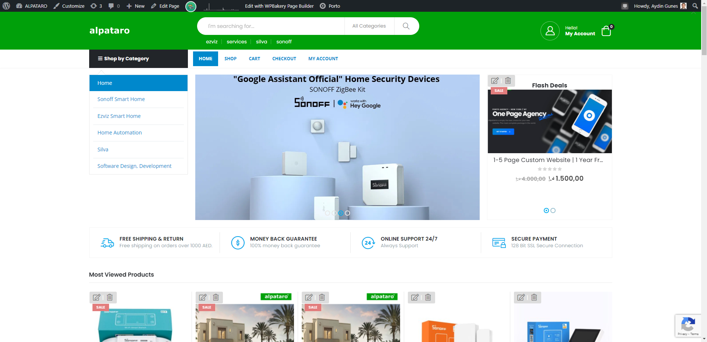

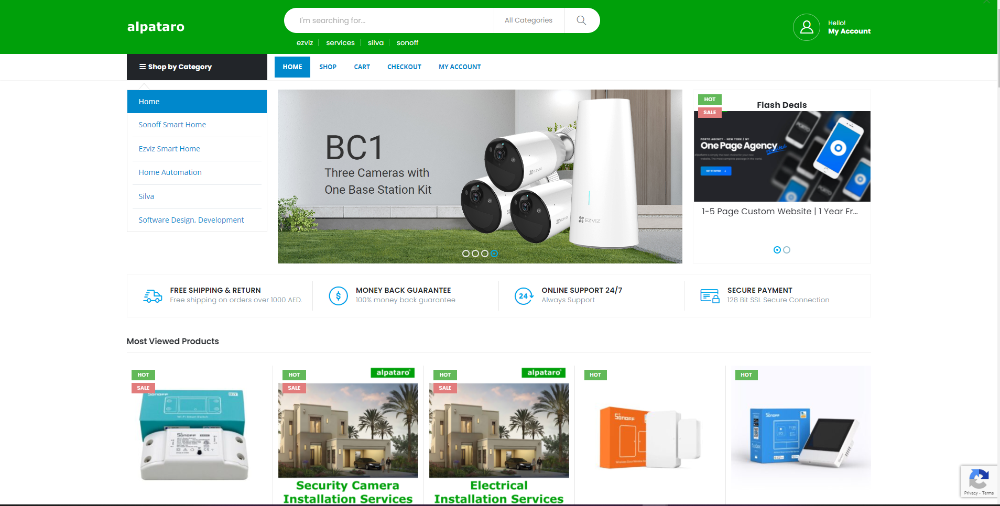

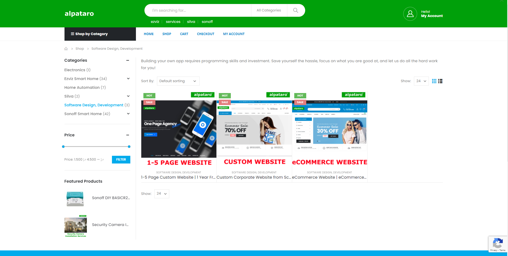

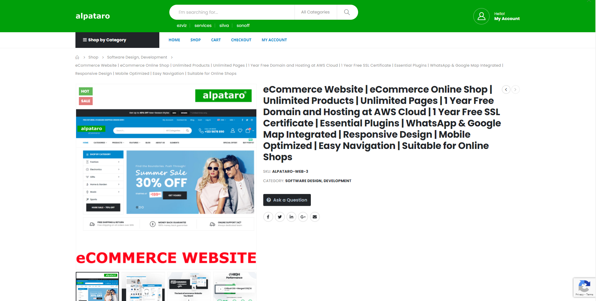

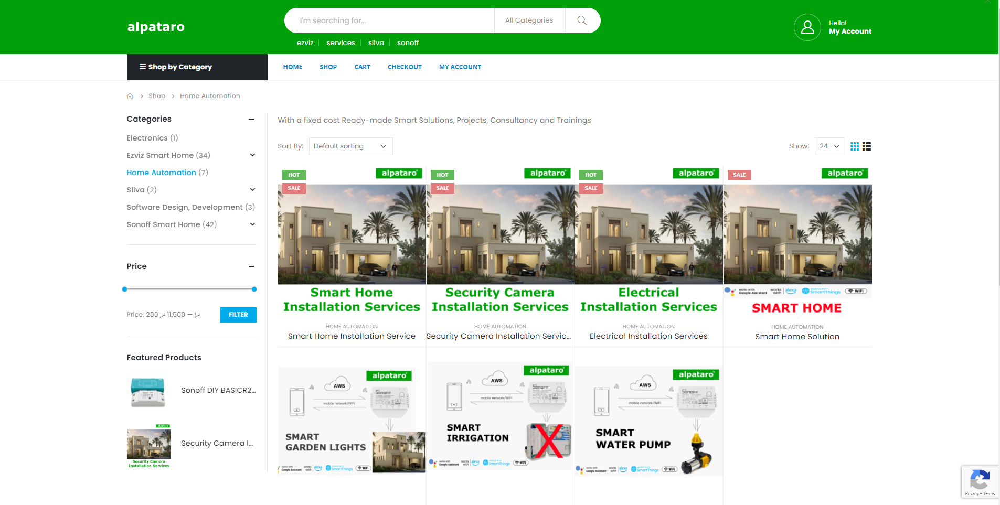

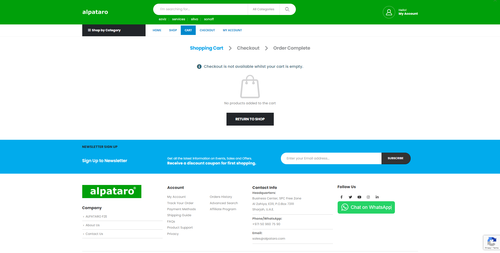

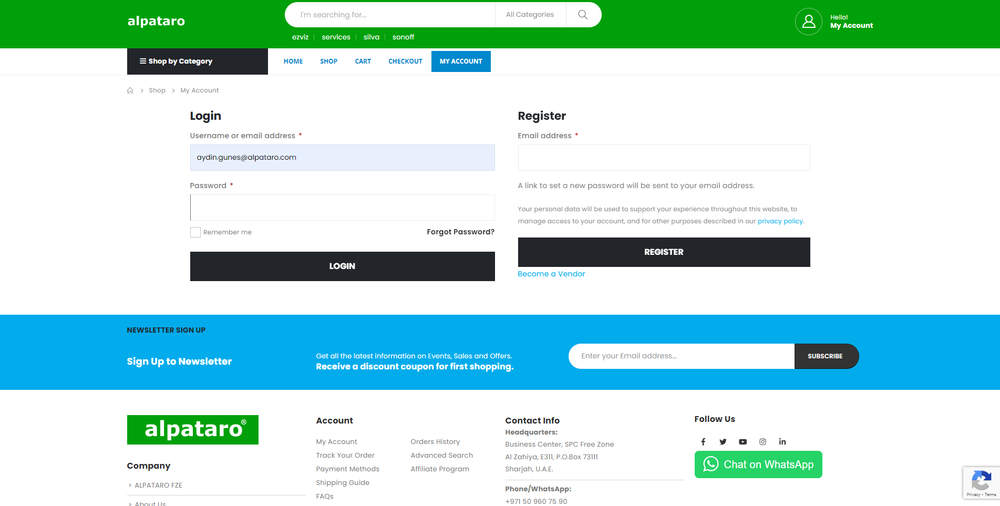

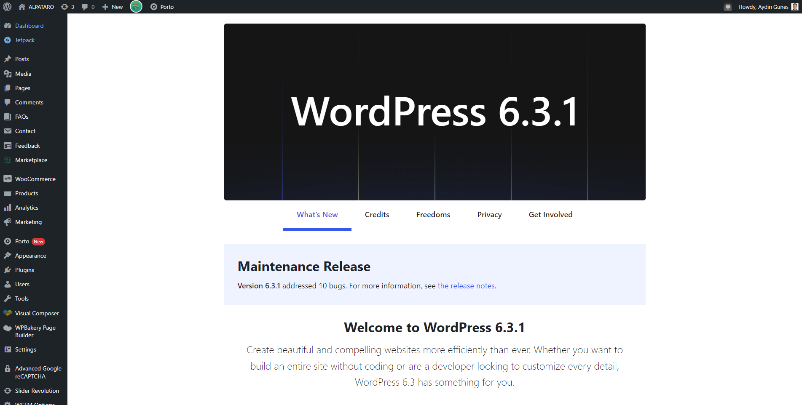

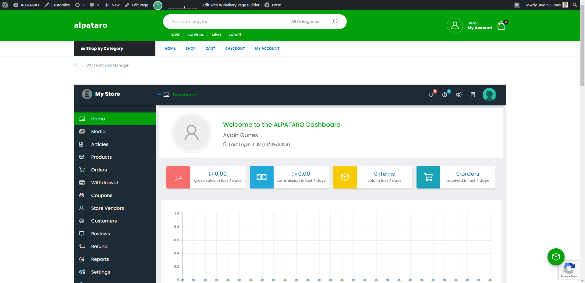

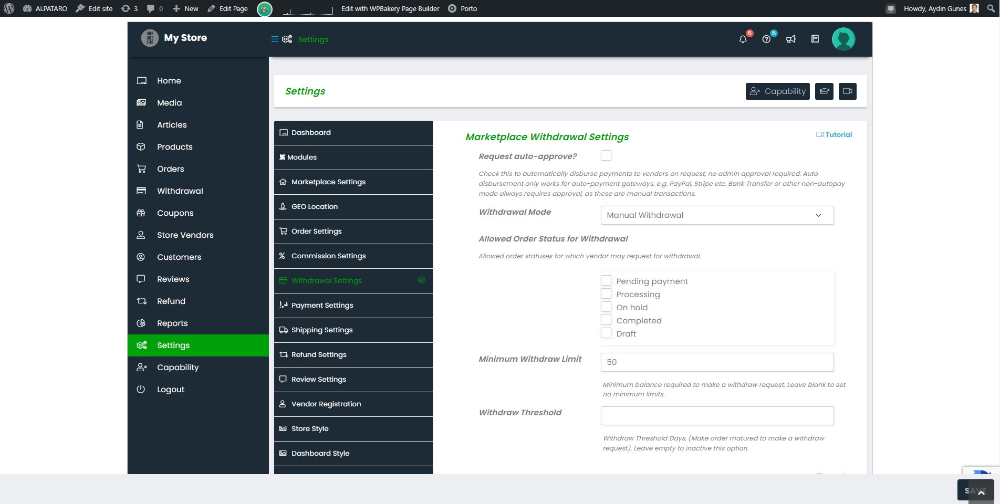

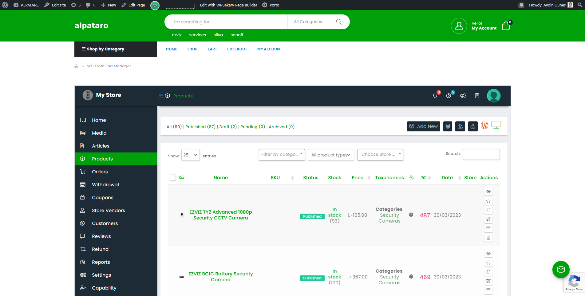

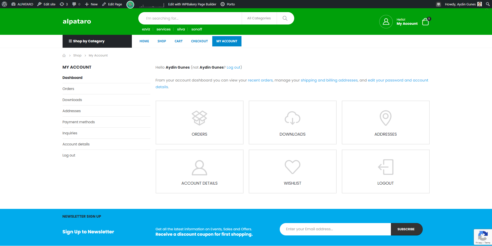

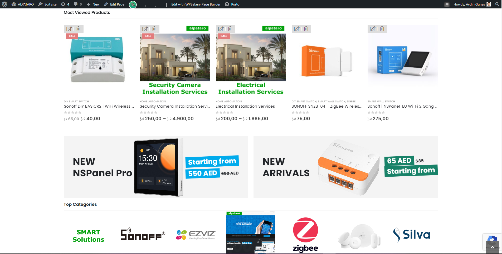

For more details about the website, visit the Alpataro Technology official online store [alpataro.com](https://alpataro.com).

For more details about Custom Website Design and Development, visit the [Alpataro Technology official website](https://alpatarotechnology.com/alpataro.html#website-design).
