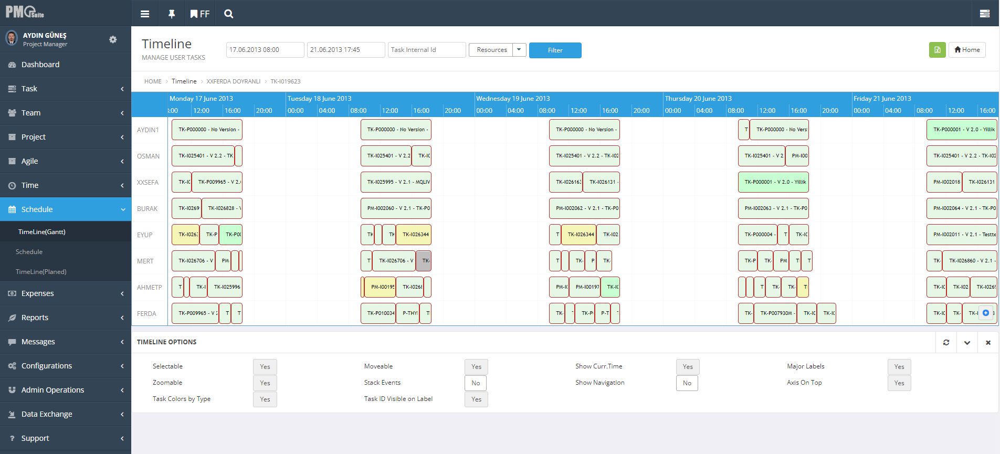

## PMOSuite.com - Project Management and Resource Planning

Welcome to the PMOSuite.com project! 

**[PMOSuite.com](#)** is a flagship project that I have been working on. It's a powerful Project Management and Resource Planning application designed to streamline project workflows and optimize resource allocation. This README provides an overview of the project, its tasks, responsibilities, and the technologies used.

Some key features of PMOSuite.com include:

- **Project Planning**: Plan and organize projects with ease, set milestones, and define project scopes.

- **Resource Management**: Efficiently allocate and manage resources, ensuring optimal utilization.

- **Task Tracking**: Monitor project progress, track tasks, and keep stakeholders informed.

- **Reporting and Analytics**: Generate insightful reports and analytics to make data-driven decisions.

- **Collaboration**: Foster collaboration among team members and stakeholders with real-time communication tools.

- **Integration**: Seamlessly integrate with other popular project management tools and services.

## Project Overview

PMOSuite.com is a powerful Project Management Online Suite designed to streamline project workflows, enhance user experience, and improve overall project management efficiency. The project involved a range of tasks and responsibilities to revamp and optimize the suite.

## Tasks and Responsibilities

As a key member of the project, my tasks and responsibilities included:

- **Revamping Project Management Online Suite**: Overhauling and modernizing the existing suite to meet current industry standards and user expectations.

- **Improving UI and UX**: Enhancing the user interface and user experience for improved usability and user satisfaction.

- **Developing Server-Side Logic**: Building server-side logic, APIs, and data storage components to support the suite's functionality.

- **Implementing Security Measures**: Ensuring the security of user data by implementing robust security measures and protocols.

- **Optimizing Application Performance**: Enhancing application performance for speed and scalability, allowing for efficient project management.

## Skills / Technologies Used

Throughout the project, I utilized a wide range of skills and technologies, including:

- **Front-End Technologies**: JSF (Primefaces), HTML, HTML5, CSS.

- **Back-End Technologies**: Java, SpringBoot, JPA, Oracle, PL/SQL, SQL.

- **Testing**: JUnit for unit testing.

- **API Development**: RESTful Services.

- **Build and Dependency Management**: Maven.

- **ETL (Extract, Transform, Load)**: TALEND for data integration.

- **Version Control**: GIT for code versioning.

- **Project Management Tools**: JIRA and Trello for project tracking and management.

- **Cloud Services**: AWS Cloud and Services, including S3, DynamoDB, Lambda, Kinesis, SNS, EC2, Route 53, CloudWatch, CloudFormation, and Light Sail.

## Contact Us

If you have any questions, feedback, or inquiries regarding PMOSuite.com, please don't hesitate to reach out to us at [support@alpataro.com](mailto:support@alpataro.com). We value your input and are here to assist you.

Thank you for using PMOSuite.com for your project management needs. We hope you find it valuable and efficient for your projects!

For more details about PMOSuite.com, visit the [alpataro technology official website](https://alpatarotechnology.com/alpataro.html#pmosuite).

